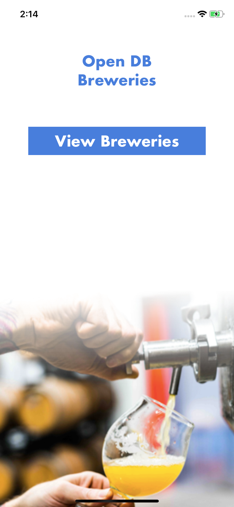
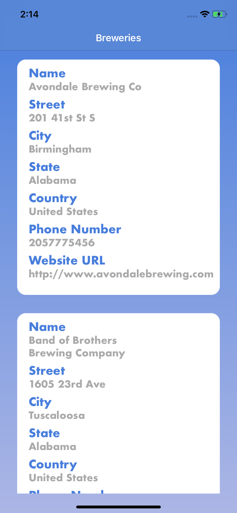

# OpenBrewery
This application is created with xcode

It demonstrates how to make an API call and present the JSON data in a tableview
The API call is made using a get request from "https://api.openbrewerydb.org/breweries"

